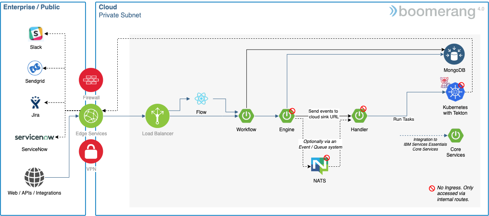

# Application Architecture

The following information depicts the components and dependencies that make up the application architecture.

## Components

The following are the default components that are part of the application architecture stack. The Agent can be replaced with a custom implementation, and the Tasks can be replaced with custom implementations.

| Component | Type         | Technology                     | Internal to Internal | External Ingress | Internal Dependency                                | External Dependency                                                      |
| --------- | ------------ | ------------------------------ | -------------------- | ---------------- | -------------------------------------------------- | ------------------------------------------------------------------------ |
| Flow      | Front End    | React + Node.js                | Flow MS              | true             |                                                    |                                                                          |
| Workflow  | Microservice | Spring Boot (Java®) | Engine MS            | true             | MongoDB®                                |                                                                          |
| Engine    | Microservice | Spring Boot (Java)             | Workflow MS          | false            | MongoDB®                                |
| Agent     | Microservice | Spring Boot (Java)             | Engine MS            | false            | Kubernetes®, Tekton® TaskRun |                                                                          |
| Task      | TaskRun      | Node.js CLI / Container        |                      | false            | Kubernetes®, Tekton® TaskRun | MongoDB® shell [image](https://hub.docker.com/r/rtsp/mongosh) |

_Notes:_

1. The Task is dynamically spun up, based on the Workflows being executed.
2. Kubernetes is required with access to ConfigMaps and PersistentVolumes.
3. Tekton TaskRuns are required for executing the individual Tasks.
4. The certified Task worker has implemented, and are bound to, specific RBAC privileges in Kubernetes.
5. If New Relic® APM is enabled it will run as a side car to the Spring Boot (Java) microservices.

## Dependencies

| Dependency                | Implementation                                                                                                                                                                                                                            | Notes                                                                |
| ------------------------- | ----------------------------------------------------------------------------------------------------------------------------------------------------------------------------------------------------------------------------------------- | -------------------------------------------------------------------- |
| Kubernetes                | <ul><li>Red Hat® OpenShift® Container Platform (4.2+)</li><li>IBM Cloud® Kubernetes Service</li><li>IBM Cloud Red Hat OpenShift Kubernetes Services</li><li>Microsoft Azure Kubernetes Service</li></ul> | Kubernetes 1.20+                                                     |
| Tekton                    | TaskRuns                                                                                                                                                                                                                                  | Part of Pipelines 0.69.0+                                            |
| Application Load Balancer | NGINX 0.23.0+                                                                                                                                                                                                                             |                                                                      |
| Database                  | MongoDB                                                                                                                                                                                                                                   |                                                                      |
| Message Streaming         | NATS Jetstream 2.3.4                                                                                                                                                                                                                      | Optional                                                             |
| Certificate Manager       | Jetstack Cert Manager (0.7.0)                                                                                                                                                                                                             | Optional if you have your own TLS certificate as a Kubernetes secret |
| Logs                      | <ul><li>Kubernetes</li><li>Grafana Loki</li></ul>                                                                                                                                                                                         | If logging enabled, default is Kubernetes                            |
| Monitoring                | New Relic Infrastructure, New Relic Kubernetes, New Relic APM Agent                                                                                                                                                                       | If enabled                                                           |
| Tracing                   | Jaeger®                                                                                                                                                                                                                         | If enabled                                                           |
