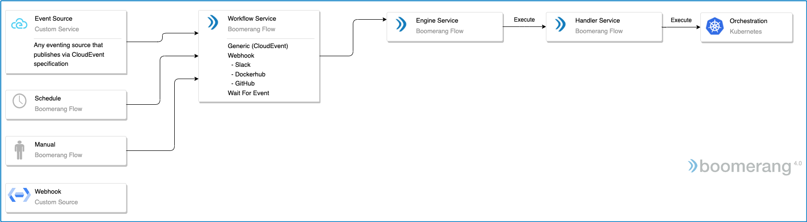

# Webhook & Events Architecture

Boomerang Flow supports events through an eventing implementation, based on CloudEvents and HTTPS/NATS. You can also optionally choose to extend this with other eventing systems, like Azure<sup>®</sup> Event Grid and KNative eventing, for example.

In turn, these events are used as triggers (based on Workflow triggers) to invoke a Workflow, or to interact with an in-flight Workflow, through the **Wait for Event** Task.



## Endpoints

### Webhook

The webhook endpoint will accept a generic webhook style event with query parameters.

See the [Webhooks and Events API Route documentation](../api/WebhooksAndEventsRoute#trigger-workflowrun-via-webhook) for more details.

**Sample Webhook Payload**

```json
{ "foo": "bar" }
```

This would then be available as a parameter on the Workflow execution as `payload` with a value of `{"foo": "bar"}`.

### Wait For Event Callback

There is a special case of webhook reserved for the **Wait For Event** Task as part of an executing Workflow.

> **Note:** This does not trigger a Workflow. This only completes a Task as part of the Workflow execution.

See the [Webhooks and Events API Route documentation](../api/WebhooksAndEventsRoute#accept-wait-for-event) for more details.

This endpoint will resolve all tasks waiting on the particular topic within the WorkflowRun. This is useful if there are multiple paths within the Workflow that you need to trigger from the same Wait For Event and you want to use the same callback URL.

### Sample Wait For Event Callback Payload

```json
{
  "name": "Boomerang Flow",
  "hello": "world"
}
```

If you were to access this payload and your Task was named the default `Wait For Event`, you can access the value of `hello` via `$(task.Wait For Event.results.data.hello)`, which would result in a value of `world`.

### Event

This endpoint accepts a full CloudEvent either in the JSON body or between the headers and the body. See below section on [CloudEvents Specification](#cloudevents-specification).

See the [Webhooks and Events API Route documentation](../api/WebhooksAndEventsRoute#accept-cloudevent) for more details.

### Sample Event Payload

| CloudEvents Attribute | Value                          |
| --------------------- | ------------------------------ |
| Type                  | `io.boomerang.eventing.custom` |
| Subject               | `/<WorkflowId>/<topic>`        |

```json
{
  "specversion": "1.0",
  "type": "io.boomerang.eventing.custom",
  "subject": "/5f7e2c8969f04975a0fff357/hello",
  "source": "/origin",
  "id": "C234-1234-1234",
  "time": "2018-04-05T17:31:00Z",
  "datacontenttype": "application/json",
  "data": {
    "images": ["645e2bc24c223dc1cc3", "10196e304f6634cc582"],
    "pushed_at": 1.417566161e9,
    "pusher": "trustedbuilder",
    "tag": "latest"
  }
}
```

## CloudEvents Specification

The [CloudEvents](https://cloudevents.io/) specification allows for an industry-wide accepted implementation. See the specifications [published here](https://github.com/cloudevents/spec).

We are currently using v1.0 of the specification, along with the HTTP, JSON, and NATS protocol bindings.

### Data attribute

The payload of the body is mapped to the CloudEvents data attribute, and in turn is available as parameters in the Workflow. See below [Payload and Parameters](#payload-and-parameters) for more details.

### Type attribute

The CloudEvents type is based on the webhook type and prefixed with `io.boomerang.eventing.`, for example, to become `io.boomerang.eventing.webhook` or `io.boomerang.eventing.wfe` or `io.boomerang.eventing.custom`.

### Subject attribute

The Workflow ID is passed in as the CloudEvents subject as `/<WorkflowId>` with an optional `/<topic>` to become `/<WorkflowId>/<topic>`.

## Payloads and Parameters

See the [Parameter Fundamentals Webook & Event Parameters](../fundamentals/parameters#webhook-and-event-parameters) for more details on how to access the payload as a parameter in the Workflow.
