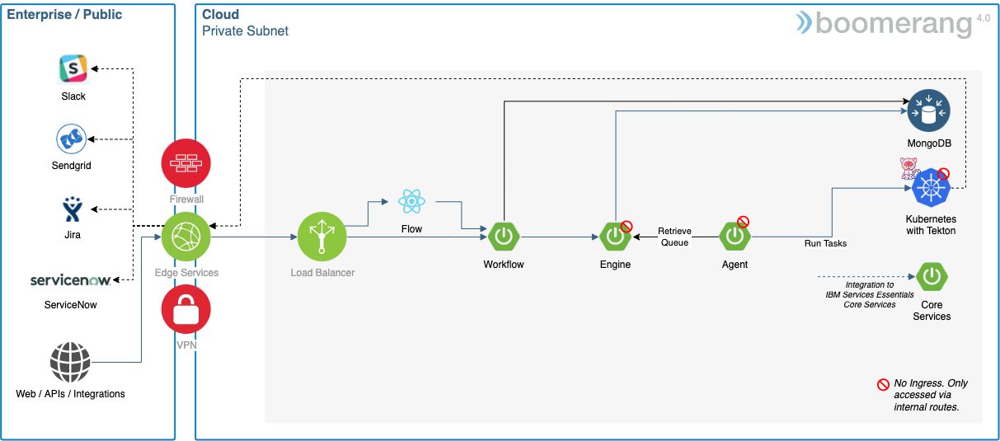

# Infrastructure Architecture

The infrastructure is based on top of Kubernetes® using Tekton® TaskRuns, ConfigMaps, Secrets, and Persistent Volumes. See the [Task architecture](../architecture/tasks) for more information.

## Components

The following are the default components that are part of the application architecture stack. The Agent can be replaced with a custom implementation, and the Tasks can be replaced with custom implementations.

| Component | Type         | Technology                     | Internal to Internal | External Ingress | Internal Dependency                                | External Dependency                                                      |
| --------- | ------------ | ------------------------------ | -------------------- | ---------------- | -------------------------------------------------- | ------------------------------------------------------------------------ |
| Flow      | Front End    | React + Node.js                | Flow MS              | true             |                                                    |                                                                          |
| Workflow  | Microservice | Spring Boot (Java®) | Engine MS            | true             | MongoDB®                                |                                                                          |
| Engine    | Microservice | Spring Boot (Java)             | Workflow MS          | false            | MongoDB®                                |
| Agent     | Microservice | Spring Boot (Java)             | Engine MS            | false            | Kubernetes®, Tekton® TaskRun |                                                                          |
| Task      | TaskRun      | Node.js CLI / Container        |                      | false            | Kubernetes®, Tekton® TaskRun | MongoDB® shell [image](https://hub.docker.com/r/rtsp/mongosh) |

_Notes:_

1. The Task is dynamically spun up, based on the Workflows being executed.
2. Kubernetes is required with access to ConfigMaps and PersistentVolumes.
3. Tekton TaskRuns are required for executing the individual Tasks.
4. The certified Task worker has implemented, and are bound to, specific RBAC privileges in Kubernetes.
5. If New Relic® APM is enabled it will run as a side car to the Spring Boot (Java) microservices.

## Dependencies

| Dependency                | Implementation                                                                                                                                                                                                                            | Notes                                                                |
| ------------------------- | ----------------------------------------------------------------------------------------------------------------------------------------------------------------------------------------------------------------------------------------- | -------------------------------------------------------------------- |
| Kubernetes                | <ul><li>Red Hat® OpenShift® Container Platform (4.2+)</li><li>IBM Cloud® Kubernetes Service</li><li>IBM Cloud Red Hat OpenShift Kubernetes Services</li><li>Microsoft Azure Kubernetes Service</li></ul> | Kubernetes 1.20+                                                     |
| Tekton                    | TaskRuns                                                                                                                                                                                                                                  | Part of Pipelines 0.69.0+                                            |
| Application Load Balancer | NGINX 0.23.0+                                                                                                                                                                                                                             |                                                                      |
| Database                  | MongoDB                                                                                                                                                                                                                                   |                                                                      |
| Message Streaming         | NATS Jetstream 2.3.4                                                                                                                                                                                                                      | Optional                                                             |
| Certificate Manager       | Jetstack Cert Manager (0.7.0)                                                                                                                                                                                                             | Optional if you have your own TLS certificate as a Kubernetes secret |
| Logs                      | <ul><li>Kubernetes</li><li>Grafana Loki</li></ul>                                                                                                                                                                                         | If logging enabled, default is Kubernetes                            |
| Monitoring                | New Relic Infrastructure, New Relic Kubernetes, New Relic APM Agent                                                                                                                                                                       | If enabled                                                           |
| Tracing                   | Jaeger®                                                                                                                                                                                                                         | If enabled                                                           |

## Kubernetes

### TaskRuns

Tekon TaskRuns are a Custom Resource Definition (CRD) wrapping Kubernetes Pods and allow us to define the Task specific metadata.

A certain amount of disk, memory, and CPU is required to process TaskRuns. Our recommendation is to run these on dedicated nodes and to set them to automatically delete. This will ensure you have enough resources to continually execute new Tasks.

### Nodes

The Workflow Tasks run as jobs on any node, unless dedicated nodes are implemented using:

- Node taint: `dedicated=bmrg-worker:NoSchedule`
- Node label: `node-role.kubernetes.io/bmrg-worker=true`

### Ephemeral storage

As with all containers, there is ephemeral storage used that we have limited to 8GB by default. This impacts the number of Tasks that can be running in parallel, based on the amount of primary disk used. This is important.

Flow Tasks have a setting to delete on completion. If this is not enabled, then the completed workers stick around and use up the available ephemeral storage.

See [Kubernetes ephemeral storage](https://kubernetes.io/docs/concepts/configuration/manage-compute-resources-container/#local-ephemeral-storage) reference information.

### Persistent volumes

There are different types of persistent volumes used by the task orchestration system and are enabled by Workflow in the Workflow Editor > Configuration.

You can configure the storage size, storage class, and access modes for the following types in the Settings under Administer. By default:

- Storage Size is set to 1GB
- Storage Class is not set. This will therefore use the default defined in your kubernetes cluster
- Access Mode is set as Read Write Many.
- Maximum Storage is set to 5GB

We recommend using [Ranchers Local Path Provisioner](https://github.com/rancher/local-path-provisioner) on the nodes executing Tasks as this allows for dynamic provisioning of local disk, that if SSD, allows for low latency high speed writes.

#### Workspaces

Workspaces are the representation of Storage in use by Boomerang Flow (and Tekton) Workflows. There are currently two workspaces available to be enabled in a Workflow. See the [Workspaces section of the Workflow Editor How to Guide](../guides/workflow-editor#workspaces) for more information.

- Workflow Workspace: This workspace will not churn often as it stays persisted and maximum storage required can be calculated by the number of workflows and maximum size i.e. if you have 100 workflows and the maximum size is set at 5GB you will have a requirement of 500GB (100GB x 5GB) of Persistent Storage needed.
- Activity Workspace: This workspace can cause churn of persistent volumes and can cause instability depending on the Storage driver you are using, we recommend using a fast provisioning Storage Class for this type of PVC. Maximum storage required can be calculated by the number of workflows x maximum concurrent executions x maximum size i.e. if you have 100 workflows and 4 concurrent workflows and maximum storage size is set at 5GB you will have a requirement of 2TB (100GB x 4 x 5GB) of Persistent Storage needed.

#### Data

All Tasks run with a data drive (`/data`) specific to that Task and based on [Kubernetes EmptyDir volume](https://kubernetes.io/docs/concepts/storage/volumes/#emptydir). Use this for inner Task workings.

### Pod Anti-affinity

If dedicated nodes are enabled, a pod-soft anti-affinity feature is also enabled to ensure that attempts are made to balance workers across nodes as best as possible.

### Image Policies

If you are implementing a Kubernetes cluster, which uses ClusterImagePolicy or ImagePolicy, you may need to add `docker.io/boomerangio/*:*` to your policies to be able to retrieve the images.

### Network

Supported for use with IPv4 networks only.
