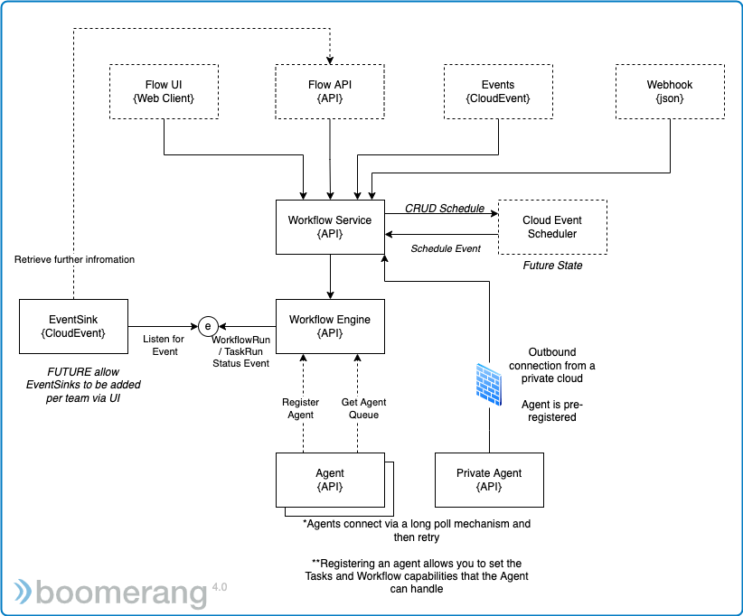
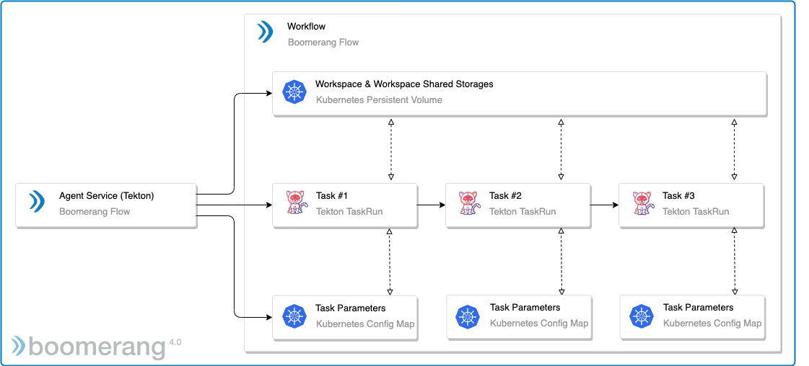
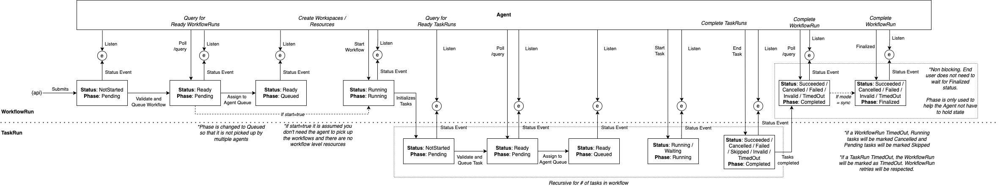

# Overview

The application has the following main components.

- **Web application**: This is the end user visual designer, enabling no-code Workflow building, as well as the ability to see and manage all aspects of your Workflows, including activity and insights.
- **Backend for frontend (BFF) microservice**: Translates the requests from the Front End application.
- **Engine microservice**: Manages the DAG lifecycle and trigger interactions.
- **Agent microservice**: Integrates with Kubernetes® and Tekton and is responsible for managing the execution of the Tasks, including the orchestration of the TaskRuns and the management of the TaskRun lifecycle. Can be replaced with a custom implementation.
- **Tasks**: The Tasks are containers mapped in the Workflow using Tekton® TaskRuns

> Navigate to the [Infrastructure Architecture](../architecture/infrastructure) to learn more.

## Agents and Execution

The default Agent executing the tasks within the DAG as part of the Workflow, relies on Tekton TaskRuns and Kubernetes to perform the execution of the Tasks that are a part of the the Workflow or Directed Acyclic Graph (DAG).

The default Agent can be replaced with a custom Agent, executing the tasks against a different cloud provider, for example Azure Container Apps.

> Navigate to the Agent [Agent Architecture](../architecture/agents) to learn more about the Agent and how it executes Tasks.

## Tasks

There are a number of different types of Tasks including pre-built Tasks designed for a no-code experience. These are single-focus Tasks that offer tight integration into the platform, with certified Tasks providing a guaranteed implementation and tested experience.

See [Getting to Know Tasks](../fundamentals/tasks) to learn more.

### Bring Your Own Container Task

The Bring Your Own Container Task is a special type of System Task where you can bring your own container and run that as a Task. Typically, the Custom Task has no knowledge or understanding of integrating with Boomerang Flow and we do not force adherence to a specific implementation. The Custom Task is denoted by a flag in the upper left corner of the Task in the Workflow Editor and Workflow Run pages.

## Status and Phases

Workflows and Tasks have both a Status and a Phase. This is to allow the Engine and Agents to process the execution as well as perform internals check that at each lifecycle point, the Workflow and Task have come from the correct prior phase.

| Phase     | Status               | Status Message       | Duration is Set | Description                                                                                           |
| --------- | -------------------- | -------------------- | --------------- | ----------------------------------------------------------------------------------------------------- |
| Pending   | Not Started          | -                    | No              | The WorkflowRun / TaskRun has been validated and queued.                                              |
| Pending   | Ready                | -                    | No              | The WorkflowRun / TaskRun has been validated and is ready to be picked up by the Agent                |
| Queued    | Ready                | -                    | No              | The WorkflowRun / TaskRun has been picked up by the Agent                                             |
| Running   | Running              | -                    | No              | The WorkflowRun / TaskRun are in progress.                                                            |
| Running   | Waiting              | -                    | No              | The TaskRun is waiting on external interaction. The WorkflowRun has tasks in Waiting but not Running. |
| Completed | Succeeded            | available            | Yes             | The WorkflowRun / TaskRun completed successfully.                                                     |
| Completed | Skipped              | available            | Yes             | The TaskRun was skipped. WorkflowRun cannot be Skipped.                                               |
| Completed | Failed               | available            | Yes             | The WorkflowRun / TaskRun failed because one of the Runs failed.                                      |
| Completed | Invalid              | available            | Yes             | The WorkflowRun / TaskRun failed due to exception / failing a check                                   |
| Completed | Cancelled            | available            | Yes             | The WorkflowRun / TaskRun was cancelled successfully.                                                 |
| Completed | TimedOut             | available            | Yes             | The WorkflowRun / TaskRun was cancelled successfully.                                                 |
| Finalized | from completed phase | from completed phase | No              | The Agent notifies the finalization of the workflow                                                   |

## Implementation Detail

You can find further implementation details and feature specifications in our [architecture repository](https://github.com/boomerang-io/architecture)
