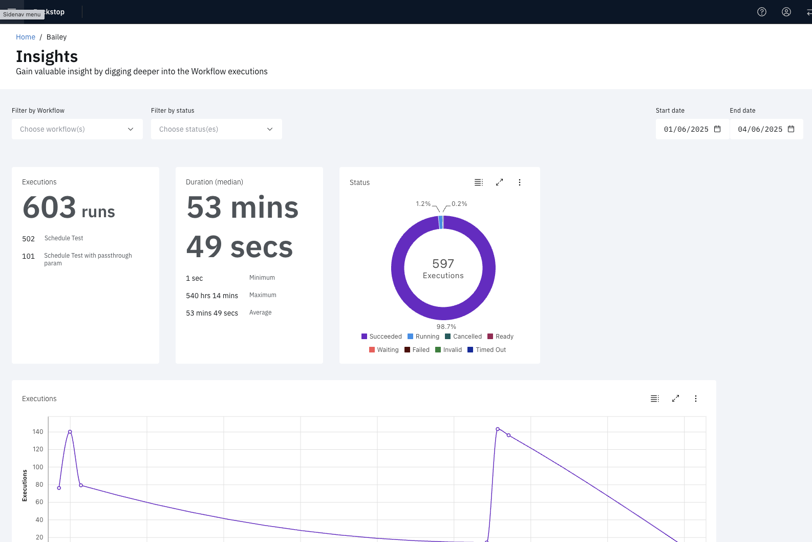

# Insights

View powerful metrics and real-time statistics on Workflow runs over time, showing peak run periods, average run times, and percentage of success and failures.

To access, select **Insights** from the menu in the upper left corner of the page.

## Filters

You can filter by a combination of Workflow and status as well as adjust the time range.

## Metrics

Insights includes the following metrics:

- number of runs
  - Total
  - By top 5 Workflows
- runtime durations
  - Median
  - Minimum
  - Maximum
  - Average
- status percentage breakdown
- peak execution periods
- plot of Execution time

> Note: narrowing the filters to a particular workflow will change some of the graphs
