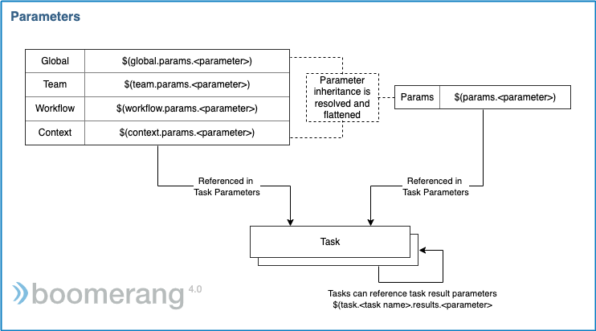

# Parameters

Parameters are an important aspect of Boomerang Flow, allowing for a powerful inheritance model, and can be set and represent the many different parts of the application. They are available throughout a Workflow or Task and are substituted at execution time.

## Parameter Syntax

You can reference parameters in a Task using the `$()` syntax.

There are a number of caveats with parameters.

- Must only contain alphanumeric characters, hyphens (-), and underscores (\_).
- Must begin with a letter or an underscore (\_).

## Parameter Availability

The following table lists the parameters and when they are available to be substituted in an execution. Additionally, parameters have an inheritance order based on the layering order indicated below. For example, defining a parameter with the same name at the Team and Workflow level will lead the Workflow parameter to override and replace the value for the Team parameter, unless referenced directly using scope.

The substitution is performed by the Workflow service when a Workflow is executed.

| Parameter Scope | Available When?                                                                                                          | Syntax                                    | Example                                          |
| --------------- | ------------------------------------------------------------------------------------------------------------------------ | ----------------------------------------- | ------------------------------------------------ |
| Global          | Throughout the Workflow lifecycle. These are defined in Boomerang Flow by Administrators.                                | `$(global.params.<parameter>)`            | `$(global.params.slackChannel)`                  |
| Team            | Throughout the Workflow lifecycle. These are defined in Boomerang Flow by teams.                                         | `$(team.params.<parameter>)`              | `$(team.params.slackChannel)`                    |
| Workflow        | Throughout the Workflow lifecycle. Created and set by a user through Editor inputs.                                      | `$(workflow.params.<parameter>)`          | `$(workflow.params.slackChannel)`                |
| Context         | Specific reserved parameters available at the execution of a Workflow.                                                   | `$(context.params.<parameter>)`           | `$(context.params.workflowrun-id)`               |
| Params          | The flattened parameters with all inheritance and substitution resolved.                                                 | `$(params.<parameter>)`                   | `$(params.slackChannel)`                         |
| Task Results    | At completion of a Task execution, these parameters can be referenced by other Tasks during the same Workflow execution. | `$(task.<Task name>.results.<parameter>)` | `$(task.My Wait For Event.results.eventPayload)` |

Although Tasks themselves have input parameters, these are defined as part of the Task template and are only able to be referenced within the Task template or by the Task code itself.

## Context Parameters

The following are the reserved parameters provided within a task

| Parameter                   | Syntax                                                                         | Description                                                                                                                                                                                  |
| --------------------------- | ------------------------------------------------------------------------------ | -------------------------------------------------------------------------------------------------------------------------------------------------------------------------------------------- |
| Task-name                   | `$(context.params.taskrun)` `$(params.taskrun-name)`                        | This is the user-specified name of the executing Task. It is unique to a Workflow.                                                                                                           |
| Task-id                     | `$(context.params.taskrun-id)` `$(params.taskrun-id)`                       | This is the unique identifier for the established Task in this particular Workflow.                                                                                                          |
| Task-type                   | `$(context.params.taskrun-type)` `$(params.taskrun-type)`                   | This is the categorization of a particular Task. Options are `template`, `decision`, `customTask`, `approval`, `setwfproperty`, `manual`, `eventwait`, `acquirelock`, and `releaselock`.     |
| Workflow-id                 | `$(context.params.workflow-id)` `$(params.workflow-id)`                     | This is the unique identifier for this Workflow.                                                                                                                                             |
| Workflow-name               | `$(context.params.workflow-name)` `$(params.workflow-name)`                 | This is the user-specified name for the Workflow.                                                                                                                                            |
| Workflow-version            | `$(context.params.workflow-version)` `$(params.workflow-version)`           | This is the revision or version of the Workflow currently being executed.                                                                                                                    |
| Workflow-activity-id        | `$(context.params.workflowrun-id)` `$(params.workflowrun-id)`               | This is the unique identifier for the particular execution of the Workflow.                                                                                                                  |
| Workflow-activity-initiator | `$(context.params.workflowrun-initiator)` `$(params.workflowrun-initiator)` | This is the user ID of the initiator of this activity.                                                                                                                                       |
| trigger-type                | `$(context.params.workflowrun-trigger)` `$(params.workflowrun-trigger)`     | This is the trigger that created this Workflow activity or execution.                                                                                                                        |
| trigger-webhook-url         | `$(context.params.webhook-url)` `$(params.webhook-url)`                     | This is the URL including domain name and context for the webhook endpoint. It is useful if you programmatically want to provide a callback URL from an endpoint triggered by your Workflow. |
| trigger-wfe-url             | `$(context.params.wfe-url)` `$(params.wfe-url)`                             | This is the URL, including domain name and context, for the wait for event endpoint.                                                                                                         |
| trigger-event-url           | `$(context.params.event-url)` `$(params.event-url)`                         | This is the URL, including domain name and context, for the event endpoint.                                                                                                                  |

### Context Token Parameters

A subset of Context parameters are tokens, which allow you to dynamically reference a token programmatically in your Workflow. This can be useful if you are sending a wait for event endpoint in an email body and need to dynamically provide the token that will be used to authenticate.

| Parameter      | Syntax                           | Description                                                                           |
| -------------- | -------------------------------- | ------------------------------------------------------------------------------------- |
| `<token-name>` | `$(context.tokens.<token-name>)` | The specific token using the token name (set at creation time) to retrieve the token. |

## Webook and Event Parameters

The following are the reserved parameters provided within a Workflow when trigger via a webhook or event.

| Parameter | Syntax                                        | Description                                                                                                                                                                |
| --------- | --------------------------------------------- | -------------------------------------------------------------------------------------------------------------------------------------------------------------------------- |
| `data`    | `$(workflow.params.data)` or `$(params.data)` | The entire JSON payload as a parameter. The JSONPath esque dot notation can be used to access the sub keys. For example, `$(params.data.<element>)`                        |
| `event`   | `$(workflow.params.data)` or `$(params.data)` | The entire JSON event (including data element) as a parameter. The JSONPath esque dot notation can be used to access the sub keys. For example, `$(params.data.<element>)` |

## Result Parameters

All Tasks can have result parameters, which as mentioned above, can be used by other Tasks in the Workflow. They are also available at the completion of a Workflow using the execution status API.

### Standard Tasks

Some Standard Tasks will output result parameters.

### Custom Tasks

See [Custom Task architecture](../architecture/overview) for more information.

As this Task is a bring-your-own container, we have provided two mechanisms for setting result parameters.

| Property Type        | Location            | Description                                                                                                                                                            |
| -------------------- | ------------------- | ---------------------------------------------------------------------------------------------------------------------------------------------------------------------- |
| Environment Variable | `/lifecycle/env`    | Any key value pair in the format of an environment variable can be placed in this file. At the termination of the worker, these will be turned into result parameters. |
| Files                | `/lifecycle/<file>` | Any file in the `/lifecycle` directory at termination of the worker will be turned into a base64-encoded parameter. The key will be the filename.                      |

## Comparison to Tekton Parameters

Boomerang Flow parameters are very similar to what you will find in Tekton® parameters and will be familiar to some of our users.

| Tekton  | Example                    | Boomerang Flow | Example                                                      |
| ------- | -------------------------- | -------------- | ------------------------------------------------------------ |
| -       | -                          | Global         | `$(global.params.<parameter>)` or `$(params.<parameter>)`    |
| -       | -                          | Team           | `$(team.params.<parameter>)` or `$(params.<parameter>)`      |
| -       | -                          | Workflow       | `$(workflow.params.<parameter>)` or `$(params.<parameter>)`  |
| Context | `$(context.pipeline.name)` | Context        | `$(context.params.workflow-name)` or `$(params.<parameter>)` |
| Task    | `$(params.<param name>)`   | Task           | `$(params.<param name>)`                                     |

Reference:

- [Using variable substitution](https://github.com/tektoncd/pipeline/blob/master/docs/Tasks.md#using-variable-substitution)
- [Variable Substitutions Supported by Tasks and Pipelines](https://github.com/tektoncd/pipeline/blob/master/docs/variables.md)

### Parameter Types

| Flow Param Type        | Tekton Param Type      |
| ---------------------- | ---------------------- |
| text                   | string                 |
| textarea               | string                 |
| email                  | string                 |
| number                 | string                 |
| url                    | string                 |
| boolean                | string                 |
| password               | string                 |
| select                 | string                 |
| multiselect _future_   | array -> enum _future_ |
| json                   | object                 |
| texteditor             | string                 |
| texteditor::<language> | string                 |
