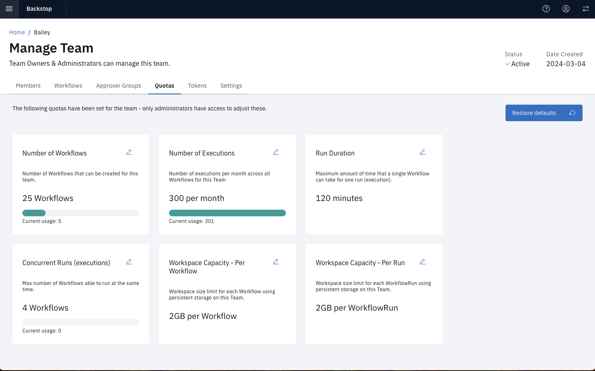

# Quotas

Quotas help provide limits and enforce governance as to what you can do.

| Quota                             | Purpose                                                                           | Default             |
| --------------------------------- | --------------------------------------------------------------------------------- | ------------------- |
| Number of Workflows               | Number of Workflows that can be created for this team.                            | 25                  |
| Number of Runs                    | Number of runs (executions) per month across all Workflows for this Team          | 300 per month       |
| Run Duration                      | Maximum amount of time that a single Workflow can take for one execution.         | 120 minutes per Run |
| Concurrent Runs                   | Max number of Workflows able to run at the same time.                             | 4                   |
| Workspace Capacity - Per Workflow | Workspace size limit for each Workflow using persistent storage on this Team.     | 2GB per Workflow    |
| Workspace Capacity - Per Run      | Workspace size limit for each Workflow Run using persistent storage on this Team. | 2GB per Workflow    |

> **Note**: Quotas are set by the Administrator. If you have a concern about your allotted amounts, contact an Administrator.

## Managing Quotas

To Manage a teams quotas:

1. Select **Manage Team** > **Team Quotas** from the hamburger menu in the upper left of the page.
2. Edit the desired quota.

## Adjusting Quota Defaults

You can adjust the defaults assigned in **Administer** > **Settings** > **Team Quotas**
