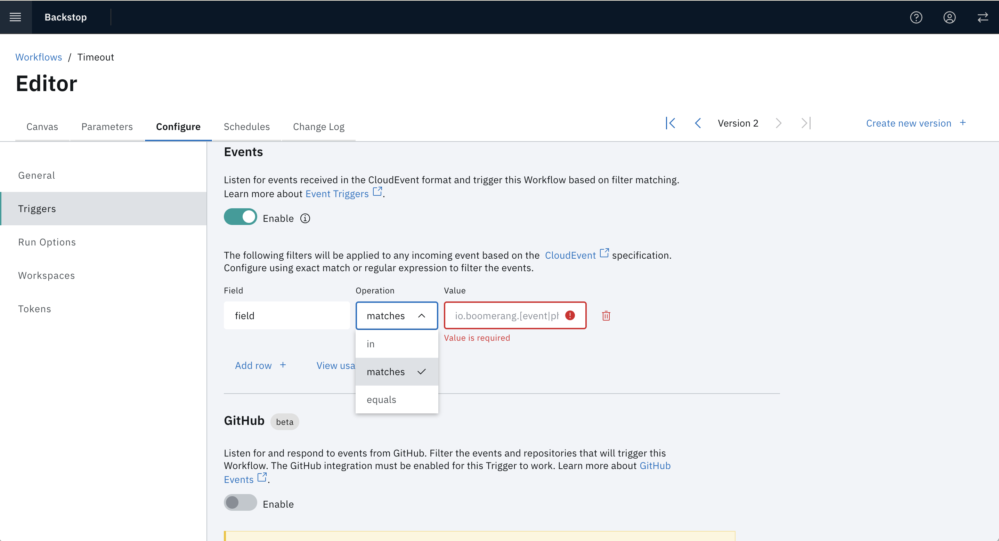

# Triggers & Integrations

Workflows can be triggered in the following ways and these can be configured in the Workflow Editor via the **Configure** tab and selecting **Triggers**.

- Manual: allows a workflow to be triggered from the Workflows page.
- Scheduler: allows a workflow to be triggered by the Schedules defined on the Schedules tab of the Workflow.
- Webhook: a simple and common API driven integration method.
- Events: a CloudEvent based trigger.
- GitHub (_beta_): a GitHub based trigger that allows you to trigger a workflow when a commit is made to a specific branch of a repository.


## Manual

Determines whether you can manually trigger the Workflow through the UI or API.

## Scheduling

Workflows can be used executed on a schedule. See [Getting To Know Schedules](../fundamentals/schedules) for more detailed information.

## Webhook

Enable the Webhook trigger, then click the **View Usage Example** link. This will open a modal with endpoint you need to use to trigger the Workflow.


### Triggering Workflow

**Request**

POST `/api/v2/trigger/webhook?workflow={workflow_id}&access_token={token}`

```json
{}
```

**Response**

After the submission, you will receive the Workflow Run payload which contains the run ID. This can be used to request the status of the Workflow Run via the API.

```json
{
  "id": "5de81b5fe638b70001fa9d09"
}
```

### Execution Status

**Request**

GET `/api/v2/team/{team}/workflowrun/{workflow_run_id}?access_token={token}`

**Response**

The response for execution status will contain the overall execution status and breakdown of individual Tasks, including the output properties of each Task if they exist.

## Events

Enable Event based triggers is similar to Webhook, however specifically for Cloud Events. It allows you to filter out the specific events sent to the system. This is useful for triggering workflows based on specific events that occur in your system or third-party services.

For example, you can trigger a workflow when a new issue is created in your issue tracker or when a new user signs up for your service.



See the [eventing architecture](../architecture/eventing) for more information.

## GitHub (_beta_)

The GitHub Trigger allows you to trigger a workflow when a valid GitHub Event is received based on the specific events you select.

For example, you can trigger a workflow when a new issue is created or a commit is made on a repository.
