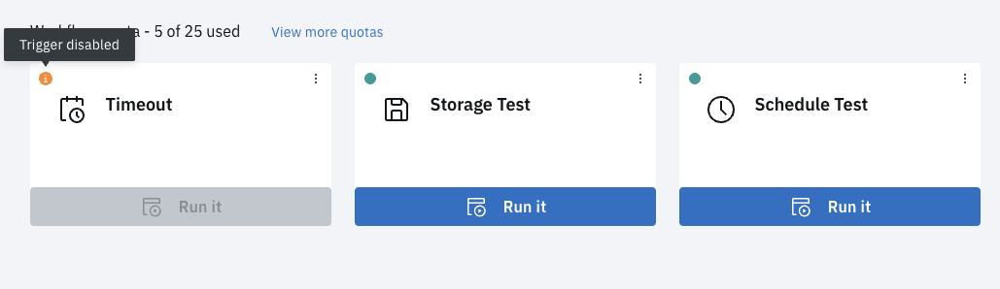

# Workflows

The Workflows page is the central area to perform actions on all your personal and team based Workflows. From here you see each Workflow as a tile and is where you create, edit, and run your Workflows.

The following functionality is available on the Workflows page.

| Control                   | Functionality                                                                                                                                                                                                                                                                                                                                                                                                                                                                                                                                                                                                                                                                                                                                                                                                                                                                                                                                                                 |
| ------------------------- | ----------------------------------------------------------------------------------------------------------------------------------------------------------------------------------------------------------------------------------------------------------------------------------------------------------------------------------------------------------------------------------------------------------------------------------------------------------------------------------------------------------------------------------------------------------------------------------------------------------------------------------------------------------------------------------------------------------------------------------------------------------------------------------------------------------------------------------------------------------------------------------------------------------------------------------------------------------------------------- |
| Search                    | The Search field refreshes the display with Workflows that contain any portion of the search text. The search results produced are restricted to Workflows in your team.                                                                                                                                                                                                                                                                                                                                                                                                                                                                                                                                                                                                                                                                                                                                                                                                      |
| View more quotas          | This opens a modal and displays the quotas applicable to either your personal Workflows or a specific team. See [Quotas](../fundamentals/quotas) for more information.                                                                                                                                                                                                                                                                                                                                                                                                                                                                                                                                                                                                                                                                                                                                                                                                        |
| **Create a new Workflow** | Displays the **Create a new Workflow** modal. A new Workflow can be created from scratch or an existing Workflow can be imported and used as a basis for the new Workflow. See [Create Workflow](../guides/create-Workflow).                                                                                                                                                                                                                                                                                                                                                                                                                                                                                                                                                                                                                                                                                                                                                  |
| Overflow Menu             | The Workflow tile overflow menu provides the following items: <ul><li>**Edit** - displays the Editor page, an advanced visual drag-and-drop no-code Workflow editor. See [Workflow Editor](../guides/Workflow-editor). </li><li>**View Activity** - displays the Activity page for the Workflow for viewing each individual execution of a Workflow. See [Activity](../fundamentals/activity).</li><li>**Update** - provides a modal where you can drag-and-drop or choose a file to update the Workflow with. It will validate that the JSON file is valid for this particular Workflow.</li><li>**Export** - provides a file that can be imported into another Flow instance.</li><li>**Duplicate** - automatically creates a new Workflow with the content of the existing Workflow. It will reset all triggers and tokens.</li><li> **Delete** - once **Delete** is selected, the Workflow is removed forever. See [Delete Workflow](../guides/delete-Workflow).</li><ul> |
| **Run it**                | Click **Run it** to kick off the corresponding Workflow. See [Execute Workflow](../guides/execute-Workflow).                                                                                                                                                                                                                                                                                                                                                                                                                                                                                                                                                                                                                                                                                                                                                                                                                                                                  |

### Workflow Status

A workflow will show various status' depending on the state of the workflow. The following status' are available:

- active(green circle): good to go
- inactive(grey circle): unable to execute
- warning(orange circle): unable to manually trigger the workflow
- warning(orange circle): reached a quota limit

### Upgrades Available

The Workflow tile will also indicate, through a yellow warning icon, if there are upgrades available for a Task within the Workflow.

## Workflow Editor

The Workflow Editor is where the magic happens for creating and managing Workflows. It is a beautiful visual drag-and-drop no-code editor for defining your Workflow as well as everything to do with your Workflow configuration, triggers, and parameters.

Refer to the [Workflow Editor](../guides/workflow-editor) instructions in the _How To Guide_.

### Features

The Workflow Editor includes the following features.

- Drag-and-drop
- Dynamic parameter resolution
- Conditional switches
- Link state logic
- Triggers
- Schedules
- Workspaces (Storage)
- Labels
- Parallelism
- Notes
- Change (audit) log
