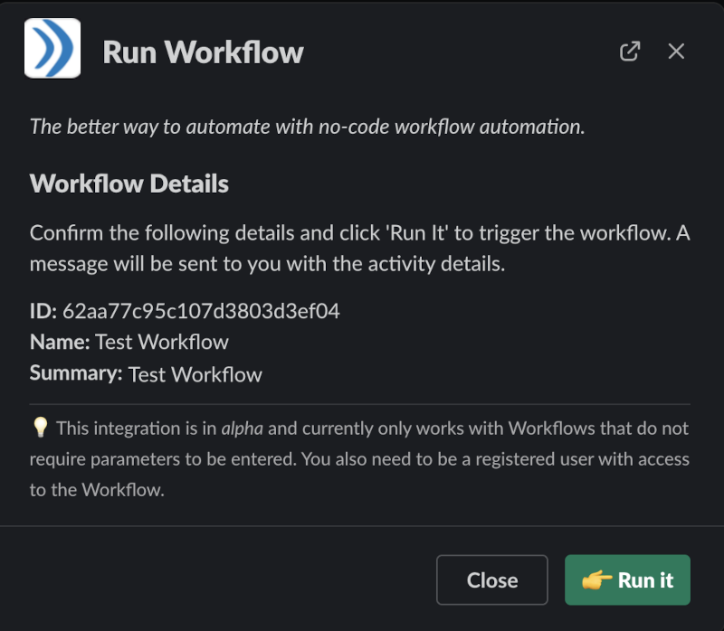

# Using the Slack App

> Note: This guide is intended for v3 and has not been updated for v4.

An embedded contextual experience letting you kick-off automation right within Slack, giving you complete control over what needs to be done.

The SRE team could be using it to respond to incidents, or the marketing team could be sending emails, or you could use it to on-board new team members. Whatever the need, everything can be automated and then triggered from Slack.

> Note: the Slack app needs to be installed to your Workspace for this to work.

## Command Reference

In Slack, you can use the following slash commands to do that

- `/workflow help` - show usage information
- `/workflow {workflowId}` - run a workflow.

> Note `/workflow` may be replaced with a different command for the specific installation of Flow.

## Running a Workflow

Its time to run some awesome automation. We can do that with the above slash command `/workflow {id}`

You will then be shown a modal with basic information for you to confirm it's the workflow you wish to run.

Select 'Run It' to kick start the automation.

A response will then be posted to you from the App with the Activity details

## No Access or No Workflow Found

If you enter a Workflow ID that doesn't exist, or you don't have access to, you will receive the following message.

## Help

You can ask for usage help from within Slack
