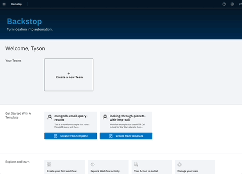

# Getting Started 🚀

Follow these steps to get up and running in no time.

## 1. Create an Account

You can either:

- Use the [Backstop.dev Cloud](backstop.dev/signup) – Sponsored with a free tier.
- Self-Host – Install Boomerang Flow on your own infrastructure.

## 2. Create Your First Team

- Click Create Team.
- Fill in a name and hit Create.

## 3. Create Your First Workflow from a Template

- Select the Hello World template and add it to your team.

## 4. Run and View Your Workflow

- On the Teams Workflow screen, find the Hello World workflow and select Run It.
- Enter the required input and click Run and View.

## 5. View the Run

🎉 Congratulations! You should now see the Run Page, where you can track the current state of your workflow in real-time.

🚀 Ready to build more? Explore our Fundamentals or Guides!

## Need help?

Select **?** in the top right corner of any page in the application to enable contextual help.

Still stuck? Join the [Boomerang IO Slack](https://join.slack.com/t/boomerang-io/shared_invite/zt-pxo2yw2o-c3~6YvWkKNrKIwhIBAKhaw) and the community will be able to help you.

## Optimal browser support

Flow is optimized from Chrome. If you are experiencing issues with another browser, please revert to Chrome and try again.
